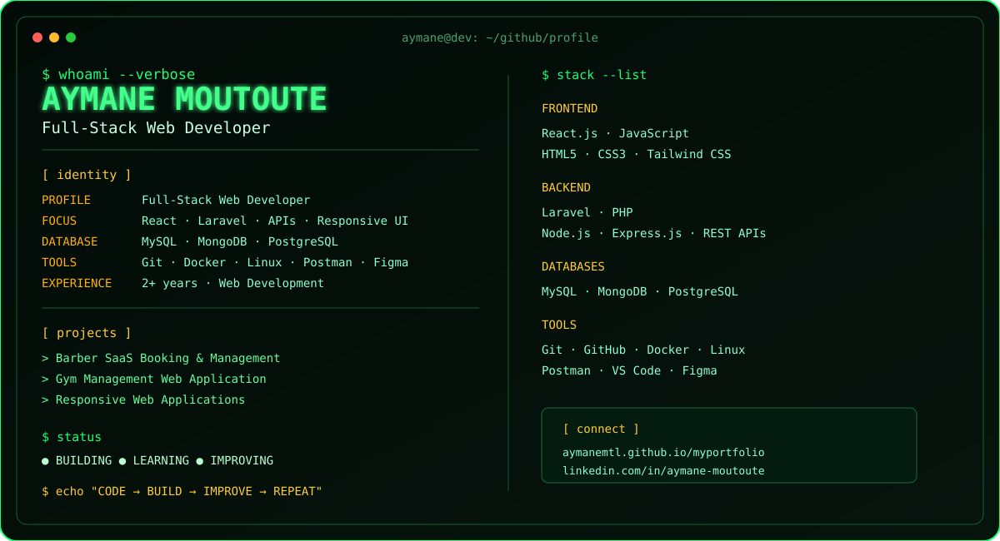

  

## 🚀 About Me

Junior Full-Stack Web Developer with 2 years of experience building and maintaining modern web applications. Focused on frontend and backend development, responsive interfaces, APIs, databases, debugging and version control.

## 🧰 Tech Stack

**Frontend:** React.js · JavaScript · HTML5 · CSS3 · Tailwind CSS · Material UI  
**Backend:** Laravel · PHP · Node.js · Express.js · REST APIs  
**Databases:** MySQL · MongoDB · PostgreSQL  
**Tools:** Git · GitHub · GitLab · Postman · VS Code · Linux · Docker · Figma

## 💼 Featured Projects

### ✂️ Barber SaaS Booking & Management Platform
SaaS platform for barbers to manage business and clients, including booking, available time slots, appointments and client information.

**React.js · Laravel · PHP · MySQL · Tailwind CSS**

### 🏋️ Gym Management Web Application
Full-stack solution for gym management, calorie calculation, exercise features, member registration, payments and class scheduling.

**React.js · Laravel · PHP · MySQL · JavaScript**

### 💻 Responsive Web Applications
Responsive interfaces built for desktop and mobile experiences.

**HTML5 · CSS3 · JavaScript · React.js · Tailwind CSS**

## 📫 Connect

- Portfolio: https://aymanemtl.github.io/myportfolio/
- LinkedIn: https://linkedin.com/in/aymane-moutoute

> CODE → BUILD → IMPROVE → REPEAT
